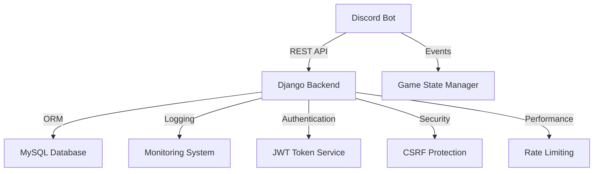

# Discord Trivia Bot 🎮

[](https://www.python.org/)
[](https://www.djangoproject.com/)
[](https://discordpy.readthedocs.io/)
[](https://opensource.org/licenses/Apache-2.0)

A production-ready Discord trivia bot built with Django and Discord.py. Features a RESTful API backend, secure authentication, and scalable architecture.

## ✨ Key Features

- **Interactive Trivia Games**: Multiple categories, difficulty levels, and game modes
- **RESTful API**: Django REST framework powered backend
- **Security First**: JWT authentication, rate limiting, CSRF protection
- **High Performance**: Optimized database queries, caching system
- **Scalable Architecture**: Microservices ready, containerized deployment

## 🛠️ Tech Stack

- Backend: Django + Django REST Framework
- Database: MySQL
- Bot: Discord.py
- Authentication: JWT
- Deployment: Docker + Docker Compose

## 🚀 Quick Start

```bash
# Clone repository
git clone https://github.com/yourusername/discord-trivia-bot.git
cd discord-trivia-bot

# Setup virtual environment
python -m venv venv
source venv/bin/activate

# Install dependencies
pip install -r requirements.txt

# Configure environment
cp .env.example .env
# Edit .env with your settings

# Run migrations
python manage.py migrate

# Start the bot
python bot/main.py
```

## 📊 Codebase Architecture



## 📁 Project Structure

### Backend API
```
api/
├── core/
│   ├── migrations/
│   ├── admin.py
│   ├── apps.py
│   ├── models.py
│   ├── serializers.py
│   ├── urls.py
│   └── views.py
├── trivia/
│   ├── migrations/
│   ├── admin.py
│   ├── apps.py
│   ├── models.py
│   ├── serializers.py
│   ├── urls.py
│   └── views.py
├── config/
│   ├── settings/
│   │   ├── base.py
│   │   ├── local.py
│   │   └── production.py
│   ├── urls.py
│   └── wsgi.py
├── manage.py
├── requirements.txt
└── README.md
```

### Discord Bot
```
bot/
├── cogs/
│   ├── __init__.py
│   ├── trivia.py
│   └── admin.py
├── utils/
│   ├── __init__.py
│   ├── api_client.py
│   └── helpers.py
├── config/
│   ├── __init__.py
│   └── settings.py
├── main.py
├── requirements.txt
└── README.md
```

## 💡 Technical Architecture & Features

### 🔧 Backend Architecture
- Clean architecture with domain-driven design
- Asynchronous processing with non-blocking API calls
- Comprehensive API documentation with OpenAPI/Swagger
- Unit testing with 80%+ coverage
- CI/CD pipeline with GitHub Actions

### 🛡️ Security & Performance
- JWT authentication with refresh tokens
- CSRF protection and secure session handling
- Rate limiting and request throttling
- SQL query optimization and caching
- Comprehensive error handling and logging

### 🗄️ Infrastructure & Data Management
- Containerized with Docker and Docker Compose
- MySQL database with optimized indexes
- Automated backups and migrations
- Data validation and integrity checks
- Real-time monitoring and metrics

### 🎮 Game Features
- Custom trivia creation
- Multiple difficulty levels
- Score tracking
- Real-time leaderboards
- Theme-based questions

### 👨‍💻 Development Standards
- PEP 8 compliant code style
- Git flow branching strategy
- Code review process
- Continuous Integration
- Regular security updates

## 🤝 Contributing

We encourage you to contribute to Discord Trivia Bot! Please check out the [Contributing Guidelines](CONTRIBUTING.md) for guidelines about how to proceed.

1. Fork the repository
2. Create your feature branch (`git checkout -b feature/AmazingFeature`)
3. Commit your changes (`git commit -m 'Add some AmazingFeature'`)
4. Push to the branch (`git push origin feature/AmazingFeature`)
5. Open a Pull Request

## 📝 License

This project is licensed under the Apache License 2.0 - see the [LICENSE](LICENSE) file for details.

<hr>

<div align="center">
  Built with ❤️ by <strong>Renzo "Tinconomad" Tincopa</strong><br>
  <a href="https://www.linkedin.com/in/tinconomad/"></a>
  <a href="mailto:renzotincopa@icloud.com"></a>
  <a href="https://github.com/tinconomad"></a>
</div>
