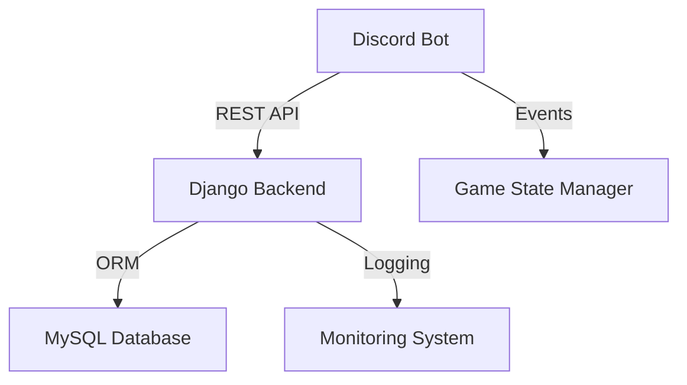
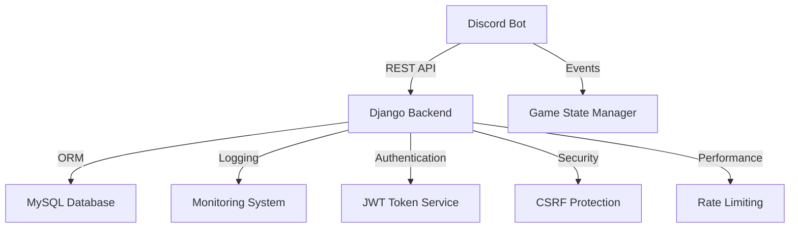

# TriviaPlatziBot

[](https://www.python.org/)
[](https://www.djangoproject.com/)
[](LICENSE)
[](https://www.docker.com/)

A sophisticated Discord bot for interactive trivia games built with Python, Django REST Framework, and Discord.py. This project demonstrates clean architecture, API design, and real-time interaction handling.

## 🌟 Features

- **Interactive Trivia Games**
    - Custom trivia creation with difficulty levels
    - Multiple choice questions with time limits
    - Real-time score tracking and leaderboards
    - Theme-based question categories

- **Modern Architecture**
    - REST API with Django REST Framework
    - Asynchronous Discord bot using discord.py
    - Clean architecture with separation of concerns
    - Comprehensive logging and monitoring

- **Security & Performance**
    - JWT token authentication
    - CSRF protection and rate limiting
    - Database query optimization
    - Docker containerization

## 🛠️ Technology Stack

- **Backend**
    - Django 5.1.2+
    - Django REST Framework
    - MySQL 8.0
    - Docker & Docker Compose

- **Bot**
    - Discord.py
    - Aiohttp
    - Python 3.8+

## 🏗️ Architecture Overview



## 🚀 Getting Started

1. Clone the repository
```bash
git clone https://github.com/yourusername/triviaPlatziBot.git
cd triviaPlatziBot
```

2. Set up environment variables
```bash
cp .env.example .env
# Configure your environment variables
```

3. Install dependencies
```bash
pip install -r requirements.txt
```

4. Start services with Docker
```bash
# Start database
docker-compose up db -d

# Run migrations
docker-compose run web python manage.py migrate

# Start all services
docker-compose up
```

## 💡 Key Features Implementation

### Asynchronous Architecture
- Non-blocking API calls
- Efficient resource management
- Real-time game state handling

### Data Management
- MySQL database integration
- Migration management
- Data validation

### Monitoring & Logging
- Request tracking
- Error logging
- Performance metrics

### 🔒 Security Features
- Secure session handling
- CSRF protection
- Rate limiting implementation
- Data validation

### 🎮 Game Features
- Custom trivia creation
- Multiple difficulty levels
- Score tracking
- Real-time leaderboards
- Theme-based questions

## 🤝 Contributing
Contributions are welcome! Please feel free to submit a Pull Request.

## 📝 License
This project is licensed under the MIT License - see the LICENSE file for details.

## 🔍 Additional Information
For more detailed information about implementation and architecture decisions, please refer to the documentation in the docs directory.

Built with ❤️ by Renzo **Tinconomad** Tincopa

## 📊 Codebase Architecture


